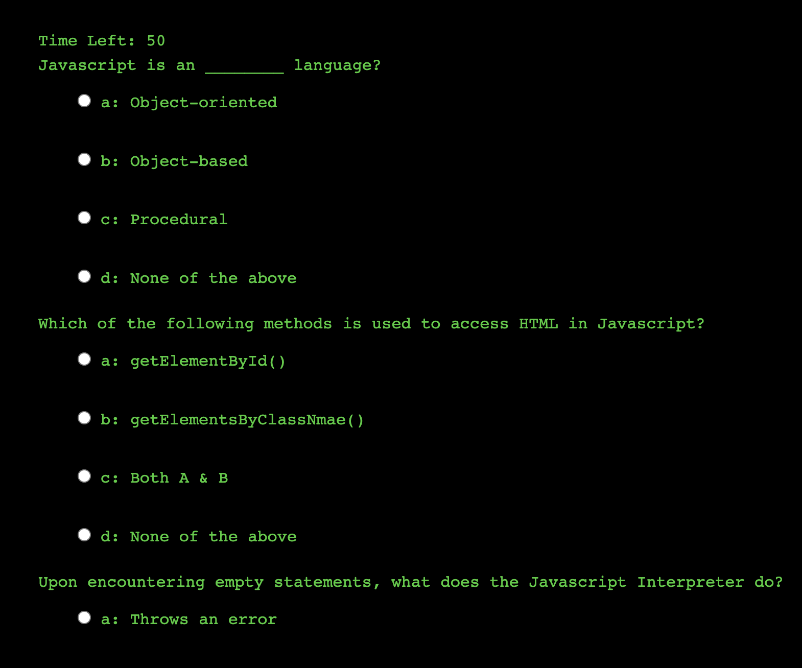

# Timed Javascript Quiz

# Ely Portfolio live
> Live demo [_here_](https://3lydaley.github.io/Daley-Portfolio/). <!-- Project link here. -->

## Table of Contents
* [General Info](#general-information)
* [Technologies Used](#technologies-used)
* [Features](#features)
* [Screenshots](#screenshots)
* [Project Status](#project-status)
* [Room for Improvement](#room-for-improvement)
* [Acknowledgements](#acknowledgements)
* [Contact](#contact)

## General Information
This is a simple timed quiz developed to experiment with javascript's time increments, dynamically adding radio buttons and HTML elements, and creating a scoring system. I gave the quiz a matrix aesthetic to add a little nerdy fun to it :

## Technologies Used
- Tech 1 - VS Code
- Tech 2 - HTML5
- Tech 3 - CSS
- Tech 4 - Javascript
- Tech 5 - Bootstrap

## Features
List the ready features here:
- Functioning timer 
- Provides User score 
- Wrong answer becomes red upon submission

## Screenshots

</img>
</img>
</img>
</img>

## Project Status
Project is: _in progress_ 

## Room for Improvement

Room for improvement:
- Adding an option to store score in Local storage
- re-formatting the quiz to display one question at a time, and allow user to go back or to skip questions. 
- Add descriptions as to why the answers were wrong or right.

## Acknowledgements

UC Berkeley Coding bootcamp!

## Contact
Created by [@3lydaley](https://github.com/3lyDaley) - feel free to contact me!

